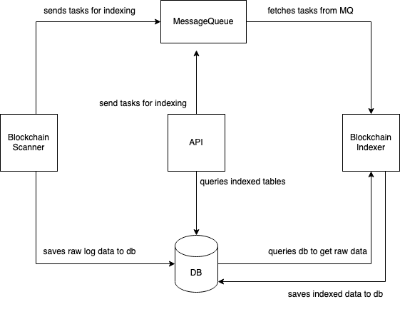

# System Overview
System consist of 3 different services 1 Database and 1 Message Queue
## Blockchain Scanner
NodeJS application scans EVM compatible blockchain and save raw logs to DB
## Blockchain Indexer
NodeJS application with multiple workers that indexes raw data with predefined tasks and saves to DB
## API
NodeJS application with Express Framework that serves indexed data
## Database
PostgreSQL
## Message Queue
RabbitMQ

# Architecture

# Process Flow

## Flow of indexing data
1. Blockchain Scanner scans raw logs and saves to DB
2. Blockchain Scanner sends indexing task over MQ to Blockchain Indexer
3. Blockchain Indexer worker gets the task and indexes raw data and saves to DB.

## Flow of start indexing a new address
1. API gets request to index an address
2. API sends MQ task to Blockchain Indexer to index transactions

## Flow of fetching transactions of an address
1. API checks if the address is tracked
2. If not tracked starts indexing a new address
3. If tracked sends the result

# Data Design

# Database Schema

Logs table for raw log data
| Logs  |   
| ------------- | 
| blockNumber  | 
| logIndex  |
|blockHash|
 |transactionIndex|
|address|
|data|
|topics|
|transactionHash|
|blockTimestamp|
-------

Indexed transactions table

| Transactions  |   
| ------------- | 
|network|
| blockNumber  | 
| logIndex  |
|transactionIndex|
|address|
|amount|
|from|
|to|
|transactionHash|
|blockTimestamp|

-------
Addresses to track table
| AddressesToTrack  |
| ------------- | 
|address|
|last_synced_block|

-------

Last synced blocks table
| LastSyncedBlock  |
| ------------- | 
|network|
|last_synced_block|

# Database Access and Migration
Sequelize ORM used for database migrations and database access

# Non Functional Requirements
## Resilience
To keep the system resilient in case of crash or out of sync:
-  Blockchain Scanner program keeps track last synced block to continue where left before the crash.
- Indexing performed by multiple workers that fetches tasks over MQ and acknowledge them after finishing task. So in case of crash task will be persisted on MQ.

## Scalability
On high demand:
- Blockchain Indexer worker count can be increased
- Database read replica with logical streaming can be created for horizontal scaling since Sequelize supports load balancing wont need additional