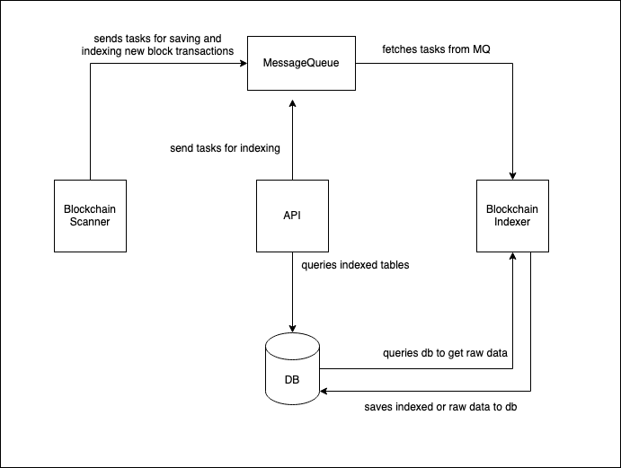

# System Overview
The system consists of 3 different services 1 Database and 1 Message Queue
## Blockchain Scanner
NodeJS application listens to EVM compatible blockchain and sends save transaction task to MQ
## Blockchain Indexer
NodeJS application with multiple workers that index raw data with predefined tasks and saves to DB
## API
NodeJS application with Express Framework that serves data
## Database
PostgreSQL
## Message Queue
RabbitMQ

# Architecture

# Process Flow

## Flow of indexing data
1. Blockchain Scanner listens for new blocks
2. When a new block arrives it sends a save block task to MQ
3. A Blockchain Indexer worker fetches task
4. Worker saves all transactions for the network and block number sent in the task object
5. Worker creates index block task and sends to MQ after saving finished
6. A worker fetches the index block task and checks if transactions in the task object are related to any of the addresses that are being tracked
7. Index transaction task created for each transaction that is related to one of the tracked addresses
8. Index transaction tasks fetched and transaction indexed by checking internal details

## Flow of start indexing a new address
1. API gets a request to index an address
2. API sends index address task to MQ
3. Index address task fetched by worker
4. Worker gets all transactions in the database that is related to the address in the task object
5. Index transaction task created for each transaction that is returned by the query
6. Index transaction tasks fetched and transaction indexed by checking internal details

## Flow of fetching transactions of an address
1. API queries transaction table

# Data Design

# Database Schema
| Transactions  |   
| ------------- | 
|network|
| transactionHash  | 
| blockNumber  |
|transactionIndex|
|from|
|to|
|gasUsed|
|cumulativeGasUsed|
|logs|
|blockHash|
|status|
|effectiveGasPrice|
|blockTimestamp|

-------
| tracked_addresses  |
| ------------- | 
|address|
-------
| networks  |
| ------------- | 
|network|
|last_synced_block|

# Database Access and Migration
Sequelize ORM used for database migrations and database access

# Non-Functional Requirements
## Resilience
To keep the system resilient in case of crash or out of sync:
-  Blockchain Scanner program keeps track last synced block to continue where left off before the crash
- Indexing and saving transactions performed by multiple workers that fetch tasks over MQ and acknowledge them after finishing the task. So in case of a crash since tasks persisted on MQ there won't be sync problems